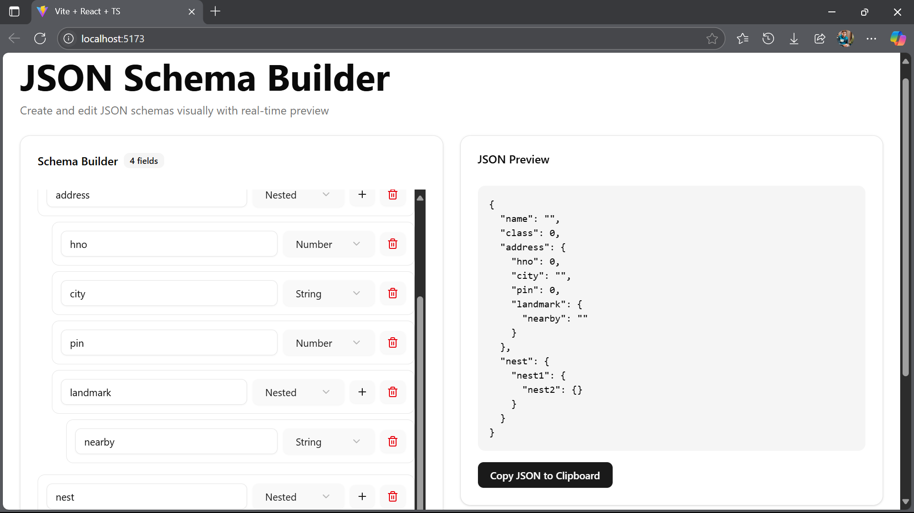
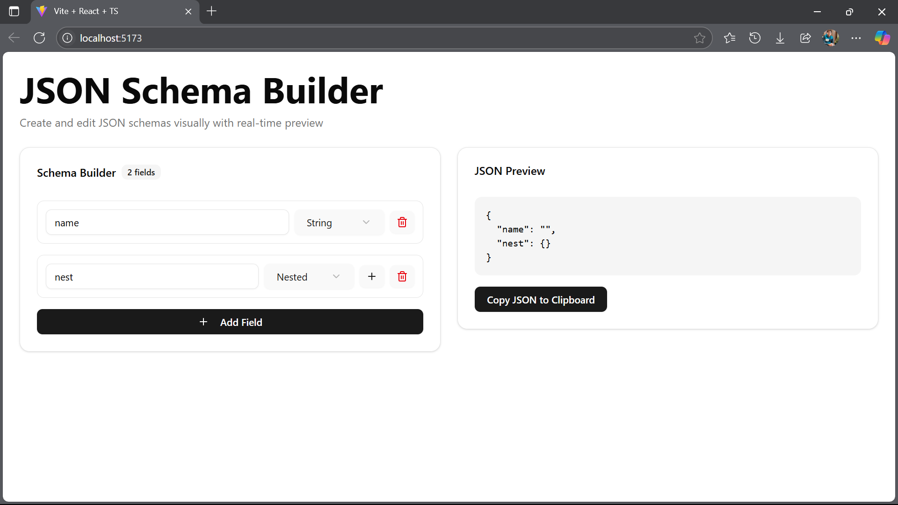

#  JSON Schema Builder – HROne Frontend Intern Task

This project is a **React-based JSON Schema Builder**, built using **ShadCN/UI components** and **TypeScript**, fulfilling the requirements of the HROne Frontend Intern Hiring Task.

It allows users to dynamically create and preview a JSON Schema with features such as nested fields, dynamic field types, and real-time JSON output.

---

##  Features

-  **Edit Field Name/Key**
-  **Add New Fields Dynamically**
-  **Delete Fields**
-  **Recursive Nesting** for `Nested` and `Array (Nested)` field types
-  **Live JSON Preview Panel**
-  **Default Values** based on selected field type
-  **Bonus:** 
  - Validation to avoid duplicate field keys
  - Extra field types: `Array`, `Object ID`
  - Copy JSON Output to Clipboard 

---

##  Tech Stack

- **React + TypeScript**
- **ShadCN/UI** (Radix UI + Tailwind CSS based)
- **Tailwind CSS** for styling
- **React Hook Form** 
- **Lucide Icons**

---

##  Folder Structure

```
src/
│
├── Components/
│   ├── JSONSchemaBuilder.tsx     # Main Component
│   ├── FieldList.tsx             # Renders all fields recursively
│   ├── FieldRow.tsx              # Row UI with input, select, buttons
│   └── ui/                       # ShadCN components (button, input, card etc.)
│
├── lib/
│   └── utils.ts                  # Helper function for classNames
│
├── App.tsx                       # App entrypoint
├── index.tsx                     # Renders <App />
└── main.css                      # Tailwind / custom styles
```

---

## ⚙️ Installation & Running Locally

Follow these steps to run the project locally:

### 1. Clone the repository

```bash
git clone https://github.com/harshtr8/jsonSchemaBuilder.git
cd jsonSchemaBuilder
```

### 2. Install dependencies

```bash
npm install
# or
yarn install
```

### 3. Run the development server

```bash
npm run dev
# or
yarn dev
```

Project will run at: [http://localhost:5173](http://localhost:5173)

---

##  Deployment 

You can deploy it easily using platforms like:

- [Vercel](https://vercel.com/)
- [Netlify](https://netlify.com/)

Just connect your GitHub repo and deploy directly.

---

## 📸 Demo Screenshot





---
